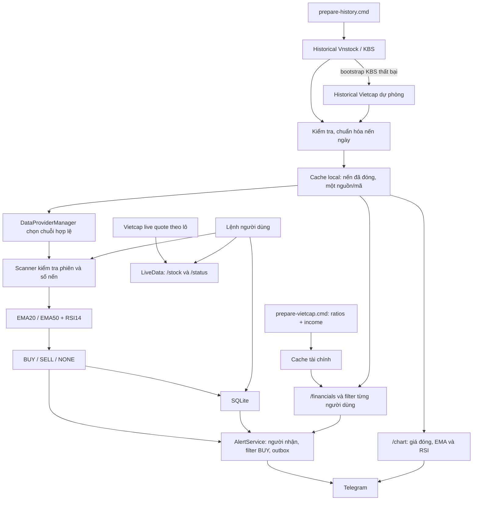

# Fintech Telegram Bot — Dự án môn học

Bot theo dõi cổ phiếu Việt Nam trên **HOSE, HNX và UPCOM**, chuẩn bị dữ liệu giá/tài chính, tính **EMA20/EMA50 + RSI14**, lưu vào SQLite và phục vụ tra cứu qua Telegram hoặc cửa sổ local. Phiên bản mã nguồn: **0.4.0**.

Tín hiệu **BUY / SELL / NONE** dùng nến ngày đã đóng. Bot không kết nối tài khoản chứng khoán hoặc đặt lệnh. Backtest là mô phỏng phục vụ học tập. README được đối chiếu với implementation hiện tại trong `Code`; báo cáo lưu từ các phiên bản trước có thể có hành vi khác.

## Mục lục

- [1. Chạy nhanh](#1-chạy-nhanh)
- [2. Môi trường và cài đặt](#2-môi-trường-và-cài-đặt)
- [3. Cấu trúc dự án](#3-cấu-trúc-dự-án)
- [4. Luồng xử lý tổng thể](#4-luồng-xử-lý-tổng-thể)
- [5. Nguồn dữ liệu và chuẩn hóa](#5-nguồn-dữ-liệu-và-chuẩn-hóa)
- [6. Chuẩn bị nến ngày](#6-chuẩn-bị-nến-ngày)
- [7. Chuẩn bị dữ liệu tài chính](#7-chuẩn-bị-dữ-liệu-tài-chính)
- [8. Logic tín hiệu](#8-logic-tín-hiệu)
- [9. Chế độ chạy và lịch xử lý](#9-chế-độ-chạy-và-lịch-xử-lý)
- [10. Thiết lập Telegram](#10-thiết-lập-telegram)
- [11. Các lệnh của bot](#11-các-lệnh-của-bot)
- [12. Bộ lọc cá nhân](#12-bộ-lọc-cá-nhân)
- [13. Cảnh báo và lưu trữ](#13-cảnh-báo-và-lưu-trữ)
- [14. Cấu hình và CSV](#14-cấu-hình-và-csv)
- [15. Backtest và kiểm thử](#15-backtest-và-kiểm-thử)
- [16. Xử lý lỗi và giới hạn](#16-xử-lý-lỗi-và-giới-hạn)

## 1. Chạy nhanh

**Thư mục chạy** là nơi có `pyproject.toml`, `fintech_bot/` và các file `.cmd`. Nếu mở toàn bộ gói bàn giao, vào `Code` trước. Các ví dụ dưới đây chạy từ thư mục mã nguồn trong Terminal của VS Code, PowerShell hoặc Command Prompt. Trên Windows có thể nhấp đúp file `.cmd` để chạy bằng giá trị mặc định.

### Thử bằng dữ liệu giả lập

Sau khi cài môi trường ở mục 2, mở `start-local.cmd` và nhập:

```text
/help
/scan
/signals
/stock FPT
/financials FPT
/subscribe FPT
/subscriptions
/exit
```

Demo không cần Internet hoặc token Telegram. Giá, volume và financials đều giả lập. Universe mẫu có 10 cổ phiếu, trong đó một mã tạm ngừng, và một ETF bị loại khỏi phạm vi cổ phiếu.

### Chạy dữ liệu thị trường và Telegram

1. Chuẩn bị historical, ban đầu có thể thử một nhóm nhỏ:

   ```powershell
   .\prepare-history.cmd --symbols FPT MBB HPG VCB SSI
   ```

2. Chuẩn bị tài chính nếu muốn dùng `/financials` hoặc filter cơ bản:

   ```powershell
   .\prepare-vietcap.cmd --symbols FPT MBB HPG VCB SSI
   ```

3. Mở `start-telegram-setup.cmd`, nhập token và bấm **Kiểm tra và lưu**.
4. Mở `start-telegram.cmd`, giữ cửa sổ chạy.
5. Vào bot trên Telegram, gửi `/start`, `/subscribe FPT`, `/alerts watchlist`, `/scan`; đợi lượt quét rồi xem `/status`, `/stock FPT`, `/signals`.

Nếu chỉ chuẩn bị năm mã nhưng cấu hình vẫn `symbols = []`, bot vẫn chọn toàn bộ universe và bỏ qua mã chưa có historical hợp lệ. Để chạy thử đúng nhóm trên, đặt `symbols = ["FPT", "MBB", "HPG", "VCB", "SSI"]` trong `configs/vietcap.toml`.

**Sau mỗi phiên:** dừng bot bằng `Ctrl+C` → chạy `prepare-history.cmd` → chuẩn bị tài chính nếu cần → mở lại bot → gửi `/scan`. `/scan` chỉ quét cache và yêu cầu refresh bảng giá, không tải historical mới qua mạng.

## 2. Môi trường và cài đặt

`pyproject.toml` khai báo Python **>= 3.11**, nhưng các script Windows hiện **yêu cầu đúng Python 3.11**. `_python.cmd` chọn theo thứ tự:

1. `%USERPROFILE%\.venv\Scripts\python.exe` — môi trường dùng chung.
2. `.venv\Scripts\python.exe` trong dự án.
3. `py -3.11`.

Nếu môi trường đầu tiên tìm thấy không phải 3.11, script báo lỗi và dừng, không bỏ qua để chọn môi trường khác. Bản hiện tại không có fallback gọi `python` trực tiếp. Chọn interpreter trong VS Code không đổi thứ tự này.

Thư viện trực tiếp là `vnstock==4.0.8`, `Pillow>=10`; phần còn lại dùng thư viện chuẩn Python như `sqlite3`, `urllib`, `tomllib`, `unittest`. Cửa sổ token cần Tcl/Tk đi kèm Python.

### Cài môi trường dùng chung trên Windows

Chạy tại thư mục mã nguồn. Nếu môi trường dùng chung đã có, kiểm tra phiên bản và giữ các thư viện đang phục vụ dự án khác.

```powershell
py -3.11 --version
# Chỉ tạo khi chưa có môi trường dùng chung:
if (-not (Test-Path "$env:USERPROFILE\.venv\Scripts\python.exe")) {
    py -3.11 -m venv "$env:USERPROFILE\.venv"
}
& "$env:USERPROFILE\.venv\Scripts\Activate.ps1"
python --version
python -m pip install -e .
```

`pip install -e .` cài package và dependencies trong `pyproject.toml`. Nếu PowerShell chặn Activate, mở Command Prompt, gọi `%USERPROFILE%\.venv\Scripts\activate.bat`, rồi chạy `python -m pip install -e .` tại thư mục mã nguồn. Khi dùng một interpreter khác bằng tay, cài thư viện vào chính interpreter đó.

Demo/CSV không gọi API thị trường. Chế độ thị trường cần truy cập KBS qua Vnstock và các endpoint public Vietcap; Telegram cần `api.telegram.org`. Dự án không tự nạp `.env`, không gọi `setup_api_key` hoặc tự thiết lập gói tài trợ Vnstock. Quyền truy cập/yêu cầu xác thực của thư viện phụ thuộc môi trường sử dụng.

## 3. Cấu trúc dự án

```text
Code/
├── README.md / pyproject.toml
├── _python.cmd
├── prepare-history.cmd / prepare-vietcap.cmd / prepare-vnstock.cmd
├── start-local.cmd / start-vietcap.cmd / start-live.cmd
├── start-telegram-setup.cmd / start-telegram.cmd
├── configs/                 # Cấu hình TOML
├── fixtures/universe.csv    # Danh sách mã mẫu của demo
├── fintech_bot/
│   ├── cli.py / __main__.py # Điểm vào chương trình
│   ├── app.py               # Ghép các thành phần ứng dụng
│   ├── config.py            # Đọc và kiểm tra cấu hình
│   ├── domain.py / market.py# Mô hình dữ liệu, đồng hồ và lịch phiên
│   ├── data/                # Provider, tải dữ liệu, cache và validation
│   ├── strategies/          # Chỉ báo và điều kiện BUY/SELL/NONE
│   ├── services/            # Scanner, live quote, filter, alerts, backtest
│   ├── storage/             # SQLite và khóa tiến trình
│   └── bot/                 # Lệnh, Telegram, nhập token và biểu đồ
├── data/                    # Dữ liệu tải/sinh khi chạy
│   ├── daily/               # Historical chuẩn hóa, một chuỗi/mã
│   ├── vnstock/             # Cache KBS, checkpoint và báo cáo
│   ├── vietcap/             # Universe, giá dự phòng, quote, financials
│   └── *.sqlite3            # Trạng thái từng chế độ/bot
├── .secrets/telegram-token.txt
├── logs/                    # Nhật ký
├── docs/                    # Tài liệu chi tiết
├── reports/                 # Kết quả những lần đánh giá trước
└── tests/                   # Kiểm thử hành vi
```

`data/`, token, database và log là dữ liệu vận hành; bản tải mã nguồn có thể không chứa sẵn chúng. Cần chuẩn bị dữ liệu/token khi chạy trên máy mới. `DU_AN_3_RAW_CHIA_SE_2026-09-25` trong gói bàn giao là snapshot cũ, không phải bản nguồn README này mô tả.

## 4. Luồng xử lý tổng thể



| Nhóm dữ liệu | Mục đích | Cập nhật |
|---|---|---|
| Historical 1d | EMA/RSI, tín hiệu, biểu đồ, backtest, ILLIQ | `prepare-history.cmd`, rồi đọc cache local |
| Live quote | Hiển thị giá/volume hiện tại, trạng thái bảng giá | LiveData gọi Vietcap theo lô tối đa 100 mã |
| Financials | EPS, P/E, P/B, ROE, nợ/vốn và filter | `prepare-vietcap.cmd`; tài chính thiếu có thể được xếp hàng khi bot chạy |

Quote không được ghép vào historical để tính EMA/RSI. Có quote không đồng nghĩa đủ lịch sử để tạo tín hiệu; lỗi quote cũng không tự làm một chuỗi historical hợp lệ mất tín hiệu.

## 5. Nguồn dữ liệu và chuẩn hóa

### Universe và điểm gọi API

Demo/CSV dùng `universe_path`; demo mặc định là `fixtures/universe.csv`. Chế độ thị trường đọc universe Vietcap, có thể bổ sung/cập nhật KBS qua `Reference().equity().list_by_exchange(source="kbs")`.

Chỉ chọn tài sản `stock` thuộc sàn cấu hình; `HSX` Vietcap được đổi thành `HOSE`. `symbols = []` chọn toàn bộ mã phù hợp trong universe hiện có. Mã không active bị scanner bỏ qua. Có trong danh sách không bảo đảm mã đủ nến hoặc được xác nhận đang giao dịch.

| Dữ liệu | Điểm gọi trong implementation |
|---|---|
| Nến KBS | `Market().equity(symbol).ohlcv(start=..., end=..., interval="1D", source="kbs")` |
| Universe Vietcap | `GET https://trading.vietcap.com.vn/api/price/symbols/getAll` |
| Quote Vietcap | `POST https://trading.vietcap.com.vn/api/price/symbols/getList`, body có `symbols` |
| Nến Vietcap | `POST https://trading.vietcap.com.vn/api/chart/OHLCChart/gap-chart`, `timeFrame="ONE_DAY"`, `countBack`, `to` |
| Tỷ số tài chính | `GET https://iq.vietcap.com.vn/api/iq-insight-service/v1/company/{symbol}/statistics-financial` |
| Báo cáo KQKD | `GET https://iq.vietcap.com.vn/api/iq-insight-service/v1/company/{symbol}/financial-statement?section=INCOME_STATEMENT` |

Các endpoint trên là cách code hiện tại truy cập nguồn, không cam kết nguồn luôn sẵn sàng. Client gửi `Origin` và `Referer` của trang trading cho cả giá và IQ, không thêm cookie, tài khoản chứng khoán hoặc `Authorization`.

Giá KBS được adapter nhân **1.000** từ nghìn đồng sang đồng; giá Vietcap giữ theo dữ liệu nguồn. Volume là số cổ phiếu nguyên. Validation kiểm tra đúng mã/khung, giá hữu hạn dương, OHLC hợp lệ, volume không âm, thời gian tăng dần không trùng và đúng lịch.

### Lịch và readiness

Múi giờ UTC+07:00. Lịch code coi thứ Hai–thứ Sáu là ngày giao dịch, trừ `data.holidays`; mốc đóng nến HOSE **14:45**, HNX/UPCOM **15:00**. Lịch nghỉ/lịch bất thường cần khai báo, không được tự tải từ nguồn chính thức.

| Trạng thái | Ý nghĩa |
|---|---|
| READY | Đủ điều kiện lớp dữ liệu đang kiểm tra; scanner vẫn kiểm tra nến cuối |
| MISSING | Thiếu cache hoặc thiếu mã trong phản hồi |
| STALE | Historical chưa tới phiên cần thiết, hoặc quote quá tuổi cho phép |
| INVALID | Schema, dữ liệu giá, thời gian hoặc nguồn gốc không hợp lệ |
| ERROR | Lỗi tải/đọc, nguồn từ chối hoặc lượt cập nhật mới nhất thất bại |
| NO_TRADE | Bảng giá xác nhận chưa có giao dịch; không tự tạo nến giá 0 |

Historical kiểm tra theo **phiên đóng gần nhất**, không chỉ theo tuổi file. Cache chuẩn cần thời điểm refresh sau mốc phiên cần thiết. Một chuỗi vẫn có thể được giữ khi mã không giao dịch gần đây, nhưng scanner bỏ qua tín hiệu mới với lý do `no_recent_trade`. Do đó historical READY có thể nhiều hơn scanner ELIGIBLE.

## 6. Chuẩn bị nến ngày

`prepare-history.cmd` gọi `fintech_bot.data.vnstock_sync`. Job chuẩn bị dữ liệu, không tính tín hiệu hoặc gửi Telegram.

### Logic lấy và dùng lại dữ liệu

1. Tải universe Vietcap nếu thiếu/hỏng; chọn mã theo sàn/`symbols` và xen kẽ ba sàn.
2. Dùng lại `data/daily/{symbol}-daily.json` nếu đủ mới, đủ nến và hợp lệ.
3. Thử chuyển cache KBS/Vietcap có sẵn sang cache chuẩn trước khi gọi API historical.
4. Với chuỗi đủ nến nhưng thiếu phiên, tải phần bổ sung từ **cùng nguồn**. KBS lấy chồng khoảng năm nến cuối, Vietcap yêu cầu số phiên thiếu cộng phần chồng. Ghép theo ngày, dữ liệu mới thay bản cũ cùng phiên.
5. Nếu thiếu đúng một phiên, quote mới sau đóng cửa có thể xác nhận không giao dịch: giữ chuỗi, ghi NO_NEW_CANDLE, không biến quote thành nến historical.
6. Nếu chưa có chuỗi hợp lệ/đủ nến, bootstrap KBS trước; thất bại mới tải **chuỗi Vietcap đầy đủ**. Không nối nến Vietcap vào đuôi lịch sử KBS.
7. Ghi JSON bằng thay thế file nguyên tử, cập nhật checkpoint và báo cáo để tiếp tục sau khi dừng.

Nếu incremental thất bại, code giữ cache cũ, ghi lỗi và không tự tải lại toàn bộ hoặc đổi nguồn. Runtime kiểm tra độ mới trước khi dùng chuỗi đó.

```powershell
# Toàn bộ universe theo cấu hình
.\prepare-history.cmd
# Nhóm mã hoặc giới hạn số mã
.\prepare-history.cmd --symbols FPT SHS ACV
.\prepare-history.cmd --limit 30
# Chỉ thử lại mã đang failed
.\prepare-history.cmd --retry-failed
# Điều chỉnh retry/khoảng nghỉ
.\prepare-history.cmd --symbols FPT --retries 2 --timeout 15 --backoff 2 --seconds-between-calls 1
# Xem toàn bộ tùy chọn
.\_python.cmd -B -m fintech_bot.data.vnstock_sync --help
```

Bootstrap Vietcap mặc định **250 nến**; `--bars` nhận 52–5.000. KBS mặc định lấy khoảng 800 ngày lịch; `--bars` không giới hạn KBS theo cùng cách. Cache chuẩn giữ tối đa **1.000 nến/mã**. Strategy mặc định cần 51 nến, nhưng job chuẩn bị và manager dùng tối thiểu 52.

Resume mặc định bật. `--no-resume` bỏ đọc checkpoint cũ nhưng vẫn có thể dùng cache hợp lệ, không bắt buộc tải lại mọi mã. Resume thường bỏ qua mã đã failed trong cùng ngày; dùng `--retry-failed` để thử lại. Lỗi ngày trước có thể được thử lại trong ngày mới.

| Kết quả job | Ý nghĩa |
|---|---|
| REUSED | Dùng lại cache đủ điều kiện |
| UPDATED | Tải và ghép phần historical mới |
| BOOTSTRAPPED | Dựng lịch sử khi chưa có chuỗi hợp lệ |
| NO_NEW_CANDLE | Kiểm tra phiên mới nhưng không có giao dịch để sinh nến |
| ERROR | Chưa hoàn tất cập nhật mã |

Xem `data/vnstock/bootstrap-progress.json`, `bootstrap-last-run.json`. READY trong tổng kết bằng `ready + reused` của job, không thay thế kiểm tra của scanner tại thời điểm chạy. KBS có chặn khoảng 9 lần gọi logic/phút trong adapter; Vietcap có khoảng cách yêu cầu, timeout và retry giới hạn. Toàn thị trường có thể tải lâu và không phải mọi mã đều READY.

## 7. Chuẩn bị dữ liệu tài chính

`prepare-vietcap.cmd` hiện chỉ tải **ratios và income**, không tải historical. Script truyền:

```text
--components ratios income --resume --max-age 604800 --timeout 30 --workers 1 --interval 2
```

Dùng lại bản tải thành công không quá 7 ngày, timeout 30 giây, một worker, yêu cầu cách nhau tối thiểu 2 giây. Có thể thêm `--symbols` hoặc `--limit`:

```powershell
.\prepare-vietcap.cmd --symbols FPT SHS ACV
.\prepare-vietcap.cmd --limit 30
.\_python.cmd -B -m fintech_bot.data.vietcap_sync --help
```

Cache gồm `{symbol}-ratios.json` và `{symbol}-income.json`. Parser ghép kỳ báo cáo, kiểm tra mã/tổ chức, chỉ nhận kỳ có **publicDate thật** đã công bố. EPS lấy từ KQKD, tỷ số từ bảng chỉ tiêu; `published_on` là ngày công bố, `observed_on` là ngày tải, `ratio_basis` là cơ sở tỷ số. EPS của kỳ và tỷ số TTM/năm có thể khác kỳ tính.

KBS financials trong adapter hiện trả không đủ khả năng vì thiếu ngày công bố đáng tin cậy; khi failover bật, manager dùng Vietcap IQ. Không tự thay ngày kết thúc quý cho ngày công bố.

### Tiếp tục sau lỗi

- Resume dùng lại phần đủ mới, nhưng phần có tên trong `failures.json` vẫn được thử lại.
- Thiếu bảng tài chính một mã không làm job tài chính dừng các mã tiếp theo.
- Với job chỉ có tài chính, 10 lỗi mạng liên tiếp gây nghỉ 30 giây rồi tiếp tục; tối đa hai lần nghỉ, sau đó nếu tiếp tục đạt ngưỡng lỗi thì dừng.
- HTTP 401/403/429 dừng lượt thu thập. 429 có thời gian chờ; client có thể mở lại sau hạn. 401/403 cần xử lý quyền/kết nối trước khi chạy lại.
- Xem `data/vietcap/sync-progress.json`, `sync-*.json`, `failures.json`. `stop-collection.flag` khiến job dừng nhận tác vụ mới; bỏ file này khi muốn tiếp tục.

Financials không bắt buộc cho EMA/RSI. `/financials MÃ` trong Telegram live có thể xếp hàng ratios/income nếu thiếu; thử lại sau khi hoàn tất. `/filter` và `/screen` không bảo đảm tải toàn bộ tài chính thiếu, nên chuẩn bị trước.

## 8. Logic tín hiệu

Chỉ dùng **giá đóng của nến 1d đã đóng**, đã đến thời điểm kiểm tra.

- EMA20/50 khởi tạo bằng SMA của 20/50 giá; sau đó `EMA_t = alpha × Close_t + (1 − alpha) × EMA_(t−1)`, `alpha = 2 / (period + 1)`.
- RSI14 dùng trung bình tăng/giảm của 14 thay đổi giá để khởi tạo, rồi làm trơn Wilder; `RSI = 100 − 100 / (1 + average_gain / average_loss)`. Cả tăng/giảm bằng 0 thì RSI = 50; chỉ loss bằng 0 thì RSI = 100.
- Cần 51 nến để so sánh EMA50 ở hai phiên cuối; chuỗi dài hơn giảm ảnh hưởng khởi tạo. Pipeline thị trường yêu cầu tối thiểu 52.

| Tín hiệu | Điều kiện mặc định tại hai phiên cuối |
|---|---|
| BUY | EMA20 trước ≤ EMA50 trước, EMA20 hiện tại > EMA50 hiện tại **và RSI hiện tại > 50** |
| SELL | EMA20 trước ≥ EMA50 trước và EMA20 hiện tại < EMA50 hiện tại; **hoặc** RSI trước > 70 và RSI hiện tại ≤ 70 |
| NONE | Không có điều kiện mới ở phiên cuối |

SELL được ưu tiên khi điều kiện vào/thoát cùng xảy ra. EMA20 đang trên EMA50 không tự tạo BUY mới; RSI đang trên 70 không tự tạo SELL nếu chưa cắt xuống. Chỉnh chu kỳ/ngưỡng trong `[strategy]`.

Scanner không phát tín hiệu mới khi thiếu lịch sử, sai lịch, chưa tới phiên cần thiết, nến cuối không có volume hoặc mã bị bỏ qua. Scanner kiểm tra cả chuỗi; sửa giá nến cũ vẫn có thể làm tính lại EMA/RSI dù nến cuối không đổi. Kết quả kèm phiên, sàn, nguồn thực tế, strategy ID, chỉ báo và lý do.

## 9. Chế độ chạy và lịch xử lý

| File | Hành vi |
|---|---|
| `start-local.cmd` | Chat demo, quét lúc bắt đầu |
| `start-vietcap.cmd` | Chat đọc cache thị trường, quét lúc bắt đầu; không tạo LiveData |
| `start-live.cmd` | Chat thị trường có updater quote; xem status lúc đầu, dùng `/scan` để quét |
| `start-telegram.cmd` | Telegram có updater quote với cấu hình Vietcap/KBS |
| `prepare-vnstock.cmd` | Tên tương thích cũ, gọi `prepare-history.cmd` |

Mặc định: `scan_interval_seconds = 900`, `cache_seconds = 30`, `stale_after_seconds = 1200`. Cache 30 giây giảm tra cứu/tính lại liên tiếp; freshness 1.200 giây liên quan quote. Historical kiểm tra theo phiên.

**Lịch hiện tại:**

- `live` và Telegram có LiveData tự refresh quote khoảng 900 giây theo lịch, có lượt đầu ngoài phiên và khoảng sau đóng cửa 15:01–15:10. Quét historical toàn thị trường được yêu cầu bằng **`/scan`**. Nhánh này hiện không tự lập lịch quét tín hiệu toàn thị trường mỗi 15 phút. `/stock MÃ` có thể quét riêng mã khi kết quả quá tuổi cache.
- Chat không có LiveData, `watch`, hoặc Telegram CSV dùng scheduler quét trong khung lịch code: 09:00–11:31 và 13:00–15:01, ngày làm việc trừ holidays. Quét cùng nến không đồng nghĩa có tín hiệu mới.
- `/scan` không tải historical. Quote mới không bảo đảm có nến ngày mới; ngày phiên của tín hiệu có thể khác ngày xem bảng giá.

`Ctrl+C` dừng chương trình; `/exit` đóng chat local. Máy cần mạng và tiến trình chạy để Telegram trả lời. Upload GitHub không tự chạy bot trên máy chủ.

## 10. Thiết lập Telegram

1. Tìm **@BotFather** chính thức, gửi `/newbot`, chọn tên và username kết thúc bằng `bot`.
2. Nhận token; mở `start-telegram-setup.cmd`, nhập token và bấm **Kiểm tra và lưu**.
3. Chương trình gọi `getMe`, `getWebhookInfo`, kiểm tra bot hợp lệ và không có webhook. Thành công mới ghi `.secrets/telegram-token.txt`; lỗi giữ token cũ.
4. Mở `start-telegram.cmd`; truy cập `https://t.me/<username>` và gửi `/start`.

Nếu bản bàn giao đã có file token hợp lệ, có thể chạy thẳng. File token chứa chuỗi thuần, không phải cú pháp `.env`. **TELEGRAM_BOT_TOKEN trong biến môi trường ưu tiên hơn file**; code không tự đọc `.env`. README không cần chứa giá trị token cụ thể.

Nếu thiếu Tcl/Tk hoặc không mở được cửa sổ:

```powershell
.\_python.cmd -B -m fintech_bot setup-telegram --console
```

### Một lượt sử dụng mẫu

```text
/start
/status
/subscribe FPT
/subscribe MBB
/alerts watchlist
/scan
/stock FPT
/signals
/financials FPT
/chart FPT
/subscriptions
```

Chờ ít nhất **5 giây** giữa các lệnh nặng (`/stock`, `/scan`, `/signals`, `/screen`, `/financials`, `/chart`). Quét universe được chia lô **25 mã** giữa các lượt polling. `/status` có thống kê historical/scanner của lượt hoàn tất gần nhất, nên có thể chưa đổi trong khi đang quét.

Bot dùng **long polling**, không cần mở cổng hoặc webhook. Chỉ xử lý lệnh trong **chat riêng**, bỏ qua tin thường/group/channel. Không chạy nhiều tiến trình getUpdates cùng một bot. CLI không cho chạy Telegram với mode demo.

## 11. Các lệnh của bot

| Lệnh | Hành vi |
|---|---|
| `/start`, `/help` | Hướng dẫn |
| `/status` | Universe, khung 1d, lượt quét, historical, quote, scanner, tài chính, outbox, hàng đợi |
| `/universe [HOSE\|HNX\|UPCOM]` | Hiện tối đa 50 mã; tổng số có thể lớn hơn |
| `/scan` | Quét cache historical; khi có LiveData, yêu cầu thêm refresh quote |
| `/stock FPT` | Tín hiệu và chỉ báo phiên đóng; thêm kết quả lọc và quote riêng nếu có |
| `/signals [trang]` | BUY/SELL trong kết quả hiện tại, 5 tín hiệu/trang; không liệt kê NONE |
| `/signals today [trang]` | BUY/SELL của ngày hiện tại đã được bot quét/lưu; không dựng mọi tín hiệu quá khứ |
| `/financials FPT` | Kỳ, ngày công bố, EPS, P/E, P/B, ROE, nợ/vốn, ILLIQ, nguồn |
| `/chart FPT` | Telegram: PNG tối đa 100 nến cuối từ cache daily chuẩn, đường giá đóng, EMA20/50, RSI14 |
| `/subscribe FPT`, `/unsubscribe FPT` | Thêm/bỏ mã theo dõi của chat; unsubscribe hủy tin chờ liên quan |
| `/subscriptions` | Watchlist của chat |
| `/alerts watchlist` | Nhận cảnh báo cho mã đã theo dõi; mặc định |
| `/alerts all` | Cảnh báo mọi mã đủ điều kiện trong universe cấu hình |
| `/alerts off` | Tắt cảnh báo, vẫn tra cứu được |
| `/filter` | Xem điều kiện lọc |
| `/filter <tên> <số>` | Thêm/đổi ngưỡng, kết hợp theo AND |
| `/filter clear` | Xóa tất cả điều kiện của chat |
| `/screen [trang]` | Mã đạt bộ lọc, 30 mã/trang; không đồng nghĩa có BUY |
| `/timeframe 1d` | Khung hỗ trợ; yêu cầu 5m cũ chuyển về 1d, giữ subscriptions |
| `/exit` | Chỉ đóng chat local |

`/step`, `/early` và quét 5m không còn hỗ trợ. `/chart` cần cache daily chuẩn và `vnstock_path`; Telegram CSV không có sẵn nguồn này. Ảnh là đường giá đóng/chỉ báo, không phải nến OHLC. Dấu MUA/BÁN là tín hiệu đã lưu gần nhất trong khoảng hiển thị, không tái tính mọi tín hiệu quá khứ. File ảnh tạm được xóa sau khi gửi/thử gửi.

## 12. Bộ lọc cá nhân

| Tên | Ý nghĩa | Ví dụ cú pháp |
|---|---|---|
| roe_min | ROE tối thiểu, nhập theo % | `/filter roe_min 15` |
| pe_max | P/E dương, tối đa ngưỡng | `/filter pe_max 20` |
| pb_max | P/B dương, tối đa ngưỡng | `/filter pb_max 3` |
| debt_max | Nợ/vốn chủ sở hữu tối đa, đơn vị lần | `/filter debt_max 1` |
| eps_min | EPS của kỳ tối thiểu, đồng/cổ phiếu | `/filter eps_min 1000` |
| illiq_max | Amihud ILLIQ tối đa | `/filter illiq_max 1e-9` |

Các số là ví dụ, không phải ngưỡng mặc định/khuyến nghị. Ngưỡng phải hữu hạn, không âm, tối đa 1.000.000; ILLIQ có thể dùng dạng khoa học.

Amihud cần **21 nến ngày đóng** cho 20 lợi suất log:

```text
ILLIQ = mean(abs(log(Close_t / Close_(t-1))) / (Close_t × Volume_t))
```

Giá trị thấp hơn thể hiện biến động trên giá trị giao dịch thấp hơn trong phép đo này. Thiếu nến, giá hoặc volume hợp lệ thì không vượt điều kiện.

Filter lưu riêng theo `chat_id`, chỉ chặn **BUY** trong `/signals`/cảnh báo, **không chặn SELL**. `/stock` vẫn cho xem tín hiệu kèm kết quả lọc. `/screen` cần ít nhất một filter và không tự biến mã đạt lọc thành tín hiệu mua.

Báo cáo phải đã công bố và không quá 400 ngày; nếu có observed_on, ngày tải không quá 100 ngày và không ở tương lai. Thiếu chỉ tiêu cần lọc thì không đạt. Mốc **7 ngày** của collector/status là tuổi refresh cache, khác ngưỡng 100 ngày của FinancialFilter. Financials không vào EMA/RSI hoặc backtest kỹ thuật.

## 13. Cảnh báo và lưu trữ

AlertService bỏ NONE, chọn người nhận theo all/watchlist/off, kiểm tra filter BUY. Với dữ liệu thật, chỉ gửi/xếp cảnh báo có **ngày phiên trùng ngày hiện tại**. Tín hiệu phiên trước vẫn có thể xem, nhưng không phát lại như cảnh báo mới.

Outbox có hạn tối đa 24 giờ, tính cả mốc đóng nến. Mặc định **10 lần thử gửi trong một cửa sổ 900 giây**, áp dụng chung, không phải riêng mỗi chat. Lỗi tạm được thử lại với khoảng chờ tăng dần; lỗi vĩnh viễn/vượt số lần thử chuyển failed. Tin mất người nhận, hết hạn, không còn qua filter, tín hiệu bị sửa hoặc dữ liệu lỗi có thể bị hủy/vô hiệu hóa.

Khóa sự kiện gồm demo/live, strategy, mã, khung, phiên, mốc đóng, trạng thái xác nhận và side. Nguồn dữ liệu chỉ là provenance, không là khóa sự kiện; đổi nguồn không tạo thêm tin cho cùng sự kiện. Deliveries lưu qua khởi động lại để chống lặp. Nếu Telegram nhận tin nhưng phản hồi mạng mất trước khi lưu xác nhận, vẫn có thể gửi lại; không bảo đảm exactly-once.

| Bảng SQLite | Vai trò |
|---|---|
| instruments, candles, financials | Universe và dữ liệu đã dùng/lưu |
| signals | Tín hiệu, chỉ báo, nguồn, chiến lược, phiên và cập nhật |
| preferences, subscriptions | Alerts mode, filter, watchlist từng chat |
| outbox, deliveries | Hàng đợi và xác nhận gửi |
| runtime_state | Offset Telegram, tiến độ trả lời nhiều phần |

Database mặc định: demo `data/demo.sqlite3`, local thị trường `data/vietcap.sqlite3`, Telegram **`data/telegram-<bot_id>.sqlite3`**. CLI `--db` đổi đường dẫn; người dùng/watchlist không tự chuyển giữa database hoặc bot ID khác.

SQLite bật WAL, thao tác database ở luồng ứng dụng. Collector và LiveData dùng `.collector.lock`; mỗi bot có khóa riêng trong `data/`. Dừng bot trước khi chạy collector. File lock còn sau crash không đồng nghĩa vẫn giữ khóa; không cần xóa database/cache để xử lý.

## 14. Cấu hình và CSV

| File | Chế độ |
|---|---|
| configs/default.toml | Demo giả lập |
| configs/vietcap.toml | Historical KBS chính, Vietcap dự phòng; quote/financials Vietcap |
| configs/local-csv.example.toml | CSV do người dùng cung cấp |

Mục thường chỉnh: symbols, database_path, data.exchanges, data.holidays, đường dẫn cache, interval, alerts, strategy. Nguồn market/financial chính hiện chỉ nhận KBS; backup_provider phải Vietcap, enable_failover điều khiển dự phòng. Đường dẫn dữ liệu tương đối tính từ gốc mã nguồn, không từ vị trí TOML.

CSV giá:

```csv
symbol,timeframe,closed_at,open,high,low,close,volume,is_closed,observed_at
FPT,1d,2026-09-18T14:45:00+07:00,100000,102000,99000,101000,100000,true,2026-09-18T14:45:00+07:00
```

Dòng trên chỉ minh họa schema; cần ít nhất 51 nến/mã và phiên đóng gần nhất để tạo kết quả hiện tại. observed_at tùy chọn cho nến đóng, mặc định bằng closed_at; thời gian phải có múi giờ/đúng mốc sàn. Giá theo đồng, volume nguyên. Loader không tự sắp lại, điền phiên thiếu hoặc sửa dữ liệu lỗi.

CSV tài chính bắt buộc `symbol,period,published_on`; tùy chọn `eps,pe,pb,roe,debt_to_equity,revenue_growth,profit_growth`. `roe=0.15` là 15%. Universe bắt buộc `symbol,exchange,name,asset_type,status`. Xem [hợp đồng dữ liệu](docs/data-contracts.md).

```powershell
.\_python.cmd -B -m fintech_bot chat --config configs/local-csv.example.toml
```

Chuẩn bị file đúng candles_path/financials_path trước khi chạy. CSV được đọc lại khi thời điểm sửa file đổi; nên thay file hoàn chỉnh. Không gọi API thị trường. Loader tài chính chọn bản công bố mới nhất của mã, không dựng dữ liệu point-in-time cho mọi thời điểm quá khứ.

## 15. Backtest và kiểm thử

### Backtest

Vòng mô phỏng không gọi API giá, dùng historical cache. Khởi tạo ứng dụng thị trường vẫn có thể tải/check universe KBS nếu chưa có cache universe. Chuẩn bị universe và historical hợp lệ trước.

```powershell
.\_python.cmd -B -m fintech_bot backtest --config configs/vietcap.toml --symbol FPT --timeframe 1d --output reports/vietcap
# Khoảng ngày minh họa, điều chỉnh theo cache thực tế
.\_python.cmd -B -m fintech_bot backtest --config configs/vietcap.toml --symbol SHS --start-date 2026-03-23 --end-date 2026-09-22 --output reports/vietcap
```

Nến trước start-date được giữ để khởi tạo; cần ít nhất hai nến trong khoảng đánh giá. Manager kiểm tra historical theo thời điểm chạy trước khi áp dụng end-date, nên ngày kết thúc cũ không biến cache stale thành READY.

Tín hiệu nến `t` khớp mô phỏng ở **giá mở nến t+1**. BUY mua số lô bằng tiền hiện có khi chưa giữ cổ phiếu; SELL thoát toàn bộ nếu đang giữ và đủ phiên. Tín hiệu cuối mẫu không có nến sau thì không khớp. SELL bị chặn vì thời gian giữ không tự treo tới ngày sau; cần tín hiệu SELL mới.

| Giả định trong BacktestSettings | Mặc định |
|---|---:|
| Vốn | 100.000.000 đồng |
| Phí mỗi lượt mua/bán | 0,15% |
| Trượt giá | 0,05% |
| Lô | 100 cổ phiếu |
| Giữ tối thiểu | 2 phiên |

Các giả định nằm trong code, chưa có CLI chỉnh từng giá trị. Báo cáo `backtest-<MÃ>-1d.json`/`.md` có return, max drawdown, closed trades, win rate, vị thế mở và giao dịch. executed_at là mốc **đóng của nến thực hiện**, dù giá dùng là giá mở. Không ép bán cuối mẫu; vị thế mở định giá theo giá đóng cuối.

### Tests và công cụ audit

```powershell
.\_python.cmd -B -m unittest discover -s tests -q
.\_python.cmd -B -m unittest tests.test_historical_pipeline tests.test_financial_collection tests.test_daily_only tests.test_provider_manager -q
.\_python.cmd -B -m fintech_bot --help
```

Tests dùng fixture, provider/client giả, thư mục tạm cho chỉ báo, dữ liệu sai/cũ, incremental/resume, failover, filter, outbox, SQLite, Telegram, biểu đồ. Tests Tcl/Tk có thể skip khi không có môi trường hiển thị; tests qua không chứng minh API thật truy cập được.

`fintech_bot.data.vietcap_audit` audit cache Vietcap thô; không thay readiness của cache chuẩn KBS/Vietcap. `fintech_bot.data.pipeline_acceptance` audit các lớp pipeline, mặc định refresh quote; dùng `--no-refresh` để bỏ lượt đó. Universe chưa cache vẫn có thể cần mạng khi khởi tạo. Xem `--help` trước khi chạy.

`fintech_bot.benchmark` và report 5m là phần di sản cần đối chiếu: benchmark hiện vẫn kiểm tra số kết quả theo hai khung, trong khi runtime chỉ có 1d. Không dùng báo cáo cũ làm cam kết coverage/hiệu năng hiện tại.

## 16. Xử lý lỗi và giới hạn

| Triệu chứng | Cách kiểm tra |
|---|---|
| Sai Python | Kiểm tra môi trường được _python.cmd chọn; cần đúng 3.11 |
| Thiếu vnstock/PIL | Cài `pip install -e .` vào đúng môi trường chạy |
| Chưa có universe | Dừng bot, chạy prepare-history.cmd |
| Có quote, historical MISSING/STALE | Chuẩn bị historical, rồi quét; /scan không tải nến thiếu |
| Resume bỏ qua failed hôm nay | Chạy prepare-history.cmd --retry-failed |
| Historical READY, scanner SKIPPED | Xem no_recent_trade, mã inactive, nến cuối/volume |
| /signals trống | NONE, chưa quét đủ hoặc BUY bị filter cá nhân loại |
| /signals today trống | Chưa lưu tín hiệu hôm nay, nến chưa đóng, hoặc chỉ có phiên trước |
| Subscribe nhưng không có alert | Kiểm tra mode, filter BUY, ngày phiên trùng hôm nay, đã gửi và đã /scan |
| Financials/filter thiếu dữ liệu | Chuẩn bị cả ratios/income, kiểm tra ngày công bố/chỉ tiêu |
| Telegram 401 | Token sai/thu hồi; kiểm tra cả biến môi trường ưu tiên và file |
| Telegram 403 | Chat chặn bot hoặc bot không có quyền gửi |
| Telegram 409/webhook | Dừng polling trùng hoặc dùng bot không webhook; code không tự gỡ webhook |
| Telegram/Vietcap 429 | Chờ hạn nguồn yêu cầu, không mở thêm collector |
| Telegram dừng sau lỗi mạng | Runner dừng sau lỗi vĩnh viễn hoặc 5 lỗi tạm liên tiếp; kiểm tra mạng rồi mở lại |
| Tiến trình khác giữ khóa | Dừng bot/collector đang dùng dữ liệu, chạy lần lượt |
| /chart không sẵn sàng | Cần cache daily chuẩn; CSV không cung cấp sẵn cache này |
| GitHub có code nhưng bot offline | Cần chạy tiến trình Python trên máy/môi trường triển khai |

Log ở `logs/app.log`, xoay khoảng 2 MB và giữ ba bản dự phòng. Status tách historical, live quote, scanner, financials; các số 0 có thể chỉ vì chưa có lượt xử lý hoàn tất.

Giới hạn: chỉ 1d; runtime live chưa tự tải historical sau phiên; API public có thể đổi schema/giới hạn/thiếu dữ liệu; lịch bất thường và corporate actions chưa được kiểm chứng đầy đủ. Financials tải hiện tại không phải dữ liệu point-in-time và không được dùng trong backtest kỹ thuật. Backtest chưa mô phỏng đủ thanh khoản, biên độ, thuế bán, khớp một phần/thanh toán; ít giao dịch không đủ kết luận hiệu quả đầu tư. Telegram chỉ chat riêng, một tiến trình/bot, chưa có phân quyền quản trị riêng cho /scan.

Tài liệu liên quan: [kiến trúc](docs/architecture.md), [chiến lược](docs/strategy.md), [Telegram](docs/telegram.md), [Vietcap](docs/vietcap.md), [KBS và failover](docs/vnstock-failover.md), [báo cáo dự án](docs/project-report.md), [bàn giao](docs/delivery.md).
