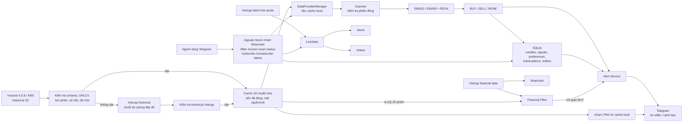

# Kiến trúc hệ thống (nến ngày 1D)

**Ranh giới dữ liệu:** Vietcap live quote phục vụ `/stock`, `/status` và kiểm tra có giao dịch khi chuẩn bị dữ liệu. Quote đang hình thành **không đi vào cache historical, Scanner hay EMA/RSI**. `/chart` đọc cache chuẩn hóa tại chỗ; chỉ tạo và gửi ảnh PNG khi người dùng gõ lệnh.

## Các thành phần trong source

| Thành phần | File | Vai trò hiện tại |
|---|---|---|
| Chuẩn bị historical | `fintech_bot/data/vnstock_sync.py`, `prepare-history.cmd` | Catch-up incremental đến phiên đã đóng gần nhất; chỉ bootstrap khi cache thiếu/hỏng/không đủ nến; KBS trước, Vietcap sau; checkpoint/resume. Vietcap batch quote chỉ loại yêu cầu historical khi thiếu đúng một phiên và xác nhận không giao dịch. |
| Cache 1D | `fintech_bot/data/daily_cache.py` | Lưu JSON theo mã với `data_source` KBS hoặc Vietcap, chỉ nến ngày đã đóng. Cache có provenance trộn nguồn bị từ chối. |
| Chọn nguồn runtime | `fintech_bot/data/provider_manager.py` | Đọc cache chuẩn, sau đó cache KBS hoặc cache Vietcap nếu cần; kiểm tra chuỗi hoàn chỉnh từng mã. Runtime scan không tải historical qua mạng và không ghép nến khác nguồn. |
| Live quote | `fintech_bot/services/live_data.py` | Cập nhật bảng giá Vietcap theo lô để hiển thị và theo dõi sức khỏe dữ liệu. Đây là nhánh riêng với historical. |
| Scanner và chiến lược | `fintech_bot/services/scanner.py`, `fintech_bot/strategies/ema_rsi.py`, `fintech_bot/strategies/indicators.py` | Kiểm tra nến đã đóng, ngày phiên, số nến và độ mới rồi tính EMA20/EMA50, RSI14. Mã chưa READY bị bỏ qua, không phát tín hiệu mới. |
| Lưu trữ | `fintech_bot/storage/sqlite.py` | Lưu universe, candles đã quét, tín hiệu, tùy chọn từng chat, subscriptions, trạng thái Telegram và notification outbox. |
| Lọc và cảnh báo | `fintech_bot/services/financial_filter.py`, `fintech_bot/services/alerts.py` | Bộ lọc tùy chọn theo người dùng gồm chỉ tiêu tài chính và Amihud ILLIQ 20 phiên. Chỉ gate BUY; SELL không bị chặn. Alert Service chọn người nhận, chống lặp và thử gửi lại từ outbox. |
| Lệnh và vận chuyển | `fintech_bot/bot/commands.py`, `fintech_bot/bot/telegram.py` | Lệnh chat và long polling Telegram. Quét toàn universe được chia lô để vẫn nhận lệnh; `/chart` vẽ PNG từ cache local rồi xóa file tạm sau khi gửi. |

Cấu hình live `configs/vietcap.toml` chỉ chọn khung `1d`. `scan_interval_seconds = 900` là chu kỳ cập nhật quote/lịch kiểm tra, **không bảo đảm mỗi mã có nến historical mới trong 900 giây**. `/scan` yêu cầu quét lại historical cache và làm mới quote; sau phiên nên dừng bot, chạy `prepare-history.cmd` rồi khởi động lại để catch-up historical. Không chạy bộ chuẩn bị song song với bot vì cùng khóa dữ liệu. Chế độ Telegram live không tự tải lại toàn bộ historical mỗi 15 phút.

